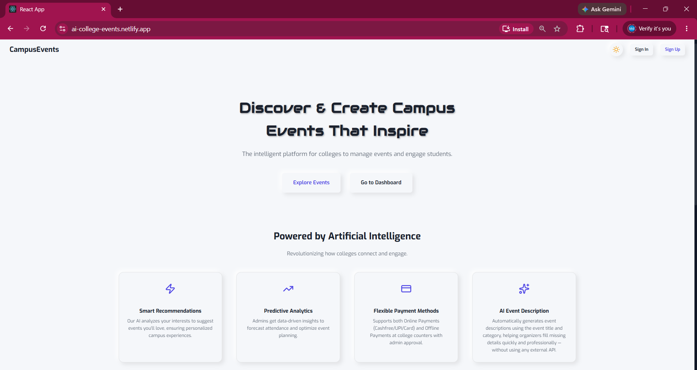
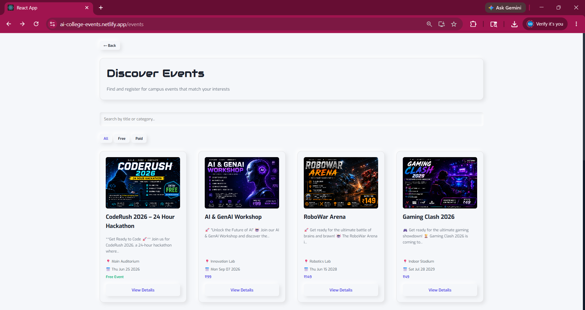
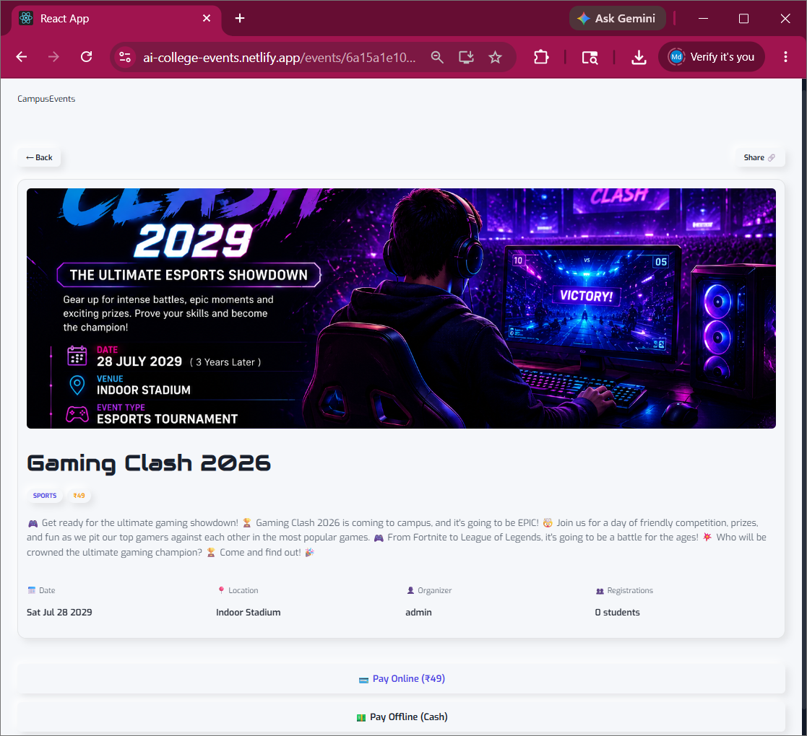
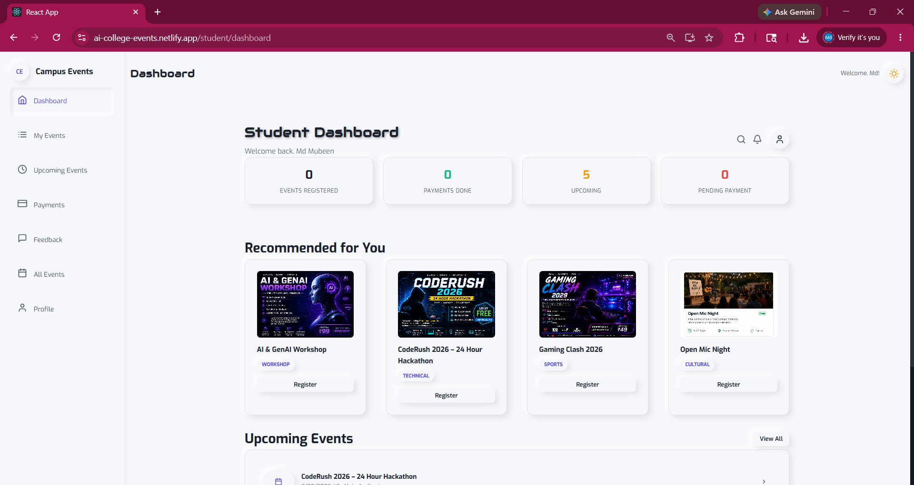
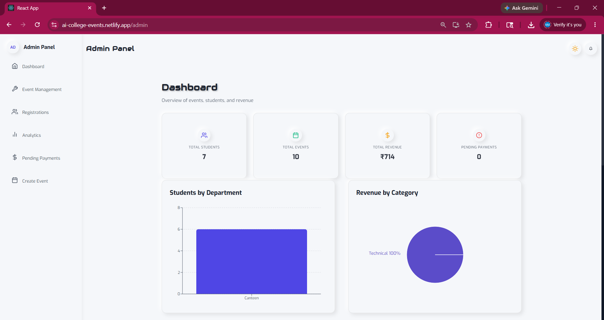
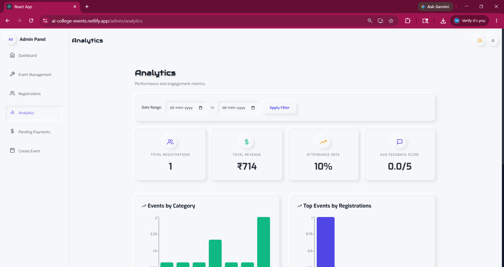
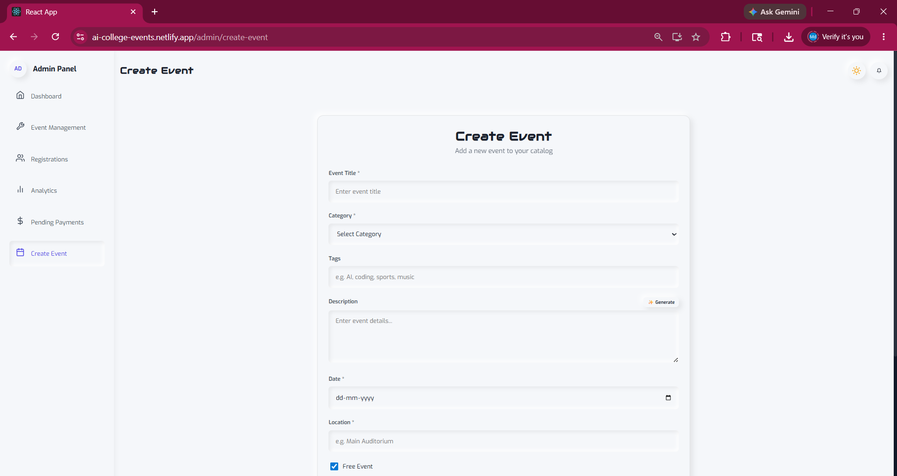
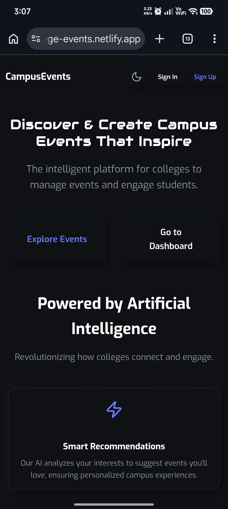
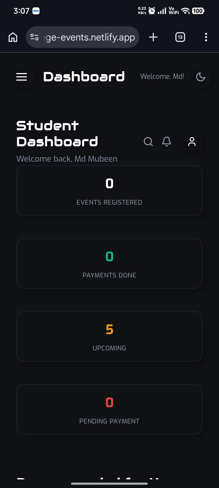
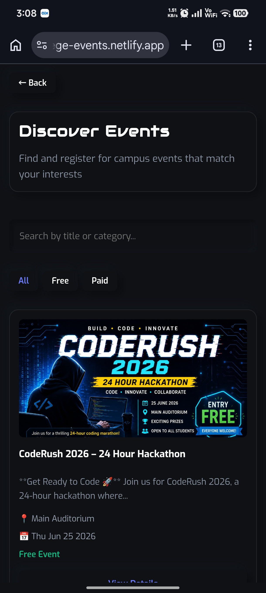

# AI College Event Management System 🎓

An **AI-powered Full Stack MERN platform** designed for managing college events with secure authentication, online & offline payments, QR ticket verification, AI-powered features and analytics dashboard.

Built to simplify event organization for colleges while improving student engagement through smart recommendations and AI-driven workflows.

---

## 🌐 Live Demo

🔗 https://ai-college-events.netlify.app/

---

## ✨ Key Highlights

✅ Full Stack MERN Architecture
✅ Secure JWT Authentication
✅ Online + Offline Payment System
✅ QR Ticket Verification & PDF Tickets
✅ AI Generated Event Descriptions
✅ AI Feedback Analysis using Groq API
✅ Smart Event Recommendation System
✅ Admin Analytics Dashboard
✅ Mobile Responsive Neumorphic UI

---

# 👨‍🎓 Student Features

* Secure Registration & Login
* Browse & Search Events
* Event Registration System
* Online Payment (Cashfree)
* Offline Payment Support
* Download Event Ticket (PDF)
* QR Code Ticket Verification
* Student Dashboard
* Event Recommendations
* Notifications & Updates
* Mobile Responsive Experience
* Dark / Light Neumorphic Theme

---

# 👨‍💼 Admin Features

* Admin Authentication
* Create / Edit / Delete Events
* Cloudinary Banner Uploads
* Registration Management
* Payment Approval & Tracking
* Event Analytics Dashboard
* Revenue & Category Insights
* Responsive Admin Panel

---

# 🤖 AI Features

* AI Generated Event Descriptions
* AI Feedback Analysis
* Smart Event Recommendations
* Groq API Integration

---

# 🛠️ Tech Stack

## Frontend

* React.js
* React Router
* Axios
* CSS / Neumorphic UI
* Responsive Design

## Backend

* Node.js
* Express.js
* MongoDB Atlas
* Mongoose
* JWT Authentication

## Cloud & Services

* Netlify (Frontend Deployment)
* Render (Backend Deployment)
* MongoDB Atlas
* Cloudinary
* Cashfree Payment Gateway

## AI Integration

* Groq API
* AI Description Generator
* Feedback Analysis Engine

---

# 📸 Project Screenshots

## 🏠 Homepage


---

## 🎫 Events Listing


---

## 📄 Event Details Page


---

## 👨‍🎓 Student Dashboard


---

## 👨‍💼 Admin Dashboard


---

## 📊 Analytics Dashboard


---

## ➕ Create Event Page


---

## 📱 Mobile Responsive UI

<p align="center">
  
  
  
</p>


# 📂 Project Structure

```bash
ai-college-event-management/
│
├── frontend/
├── backend/
├── public/
├── README.md
└── package.json
```

---

# ⚙️ Installation & Setup

## Clone Repository

```bash
git clone https://github.com/mdmubeen001/ai-college-event-management.git
```

## Frontend Setup

```bash
cd frontend
npm install
npm start
```

## Backend Setup

```bash
cd backend
npm install
npm start
```

or

```bash
npx nodemon server.js
```

---

# 🔐 Environment Variables

Create `.env` inside backend folder:

```env
MONGO_URI=your_mongodb_connection
PORT=5000
JWT_SECRET=your_secret_key

CLOUDINARY_CLOUD_NAME=your_cloud_name
CLOUDINARY_API_KEY=your_api_key
CLOUDINARY_API_SECRET=your_api_secret

CASHFREE_APP_ID=your_cashfree_app_id
CASHFREE_SECRET_KEY=your_cashfree_secret

GROQ_API_KEY=your_groq_api_key
```

---

# 🚀 Future Improvements

* Email Notifications
* Attendance Tracking
* Admin Approval Workflow
* Calendar Integration
* Advanced AI Insights
* Multi-College Support

---

# 👨‍💻 Author

**Mohammed Mubeen**

GitHub:
https://github.com/mdmubeen001

---

# ⭐ Support

If you found this project useful, consider giving it a **⭐ on GitHub**.
It helps support development and motivates future improvements.


